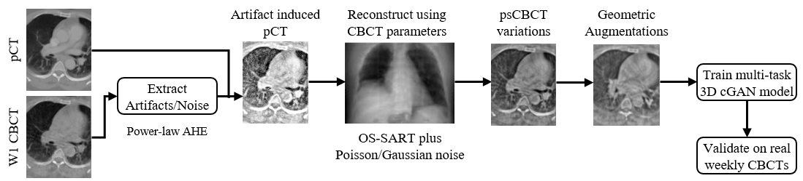

### MultiTaskCBCT2CT: Multitask 3D CBCT-to-CT Translation and Organs-at-Risk Segmentation Using Physics-Based Data Augmentation

[Read Link](https://arxiv.org/abs/2103.05690v2)

*Weekly cone-beam computed tomography (CBCT) images are primarily used for patient setup during radiotherapy. To quantify CBCT images, we present a 3D multitask deep learning model for simultaneous CBCT-to-CT translation and organs-at-risk (OARs) segmentation driven by a novel physics-based artifact/noise-induction data augmentation pipeline. The data augmentation technique creates multiple paired/registered synthetic CBCTs corresponding to a single planning CT which in turn can be used to translate real weekly CBCTs to better quality CTs while performing OAR segmentation using the high-quality planning CT contours. Given the resultant perfectly-paired CBCT and planning CT/contours data, we use supervised conditional generative adversarial network as the base model which, unlike CycleGAN -- prevalent in CBCT-to-CT translation literature -- and other unsupervised image-to-image translation methods, does not hallucinate or produce randomized outputs. We also use a large 95 patient lung cancer dataset with planning CT and weekly CBCTs.*
**Figure**. *Entire workflow of generating different variations of perfectly paired pseudo CBCT variations from single deformable registered planning CT and week1 CBCT pair. The generated data is used to train a multitask 3D pix2pix model to generate synthetic CT and OAR segmentations.*
## Prerequisites:
```del
NVIDIA GPU (Tested on NVIDIA RTX 2080 Ti)
CUDA CuDNN (CPU mode and CUDA without CuDNN may work with minimal modification)
Python 3
Pytorch>=0.4.0
torchvision>=0.2.1
dominate>=2.3.1
visdom>=0.1.8.3
```

## Dataset:
All images must be 128x128x128 in size (DxHxW). During training the network takes a 128x128x128 CBCT image as input and produces the corresponding synthetic CT and a synthetic multi-label OAR segmentation. During training, to compute the loss functions, it also needs the real CT and real multi-label OAR segmentation. So, all images are converted into numpy (*.npz) images which can store multiple arrays as dictionaries. The dictionaries keys are 'CT', 'CBCT' and 'RTSTRUCTS'. Multiple RT structures (OAR segmentations), are converted into single multi-label image. We trained our models with Esophagus label = 4, spinal cord = 3, heart = 2 and lungs = 1. 

For testing purpose, for any unavailable image in the pairing set, just put the CBCT image or a blank image in the final paired image in place of the missing image in the pair. Some example python scripts are provided in 'preprocess' subdirectory as examples of preprocessing needed to produce training/testing data. 
Data needs to be arranged in the following order:
```
datasets/XXX_Dataset 
    ├── test
    ├── val
    └── train
```

## Training:
To train a model:
```
python train.py --dataroot ./datasets/XXX_Dataset
                --netG unet_128 
                --name Experiment_Name
                --stabilize 
                --input_nc 1 
                --output_nc 2 
                --model pix2pix3d 
                --direction BtoA 
                --lambda_L1 100 
                --dataset_mode cbct2ct3d 
                --norm batch --batch_size 1 
                --display_port 8097 
                --lr 0.0001 
                --display_freq 1000 
                --print_freq 1
```
* To view training losses and results, open the URL http://localhost:8097. For cloud servers replace localhost with your IP.
* To epoch-wise intermediate training results, ./checkpoints/Experiment_Name/web/images
* Trained models will be by default save in ./checkpoints/Experiment_Name.
* You can also put the training command above in scripts/train_cbct2ct3d.sh and simply run ./scripts/train_cbct2ct3d.sh from command line.
## Testing:
To test the model:
```
python test.py --dataroot ./datasets/XXX_Dataset
               --netG unet_128 
               --name Experiment_Name 
               --phase test 
               --mode eval 
               --model pix2pix3d 
               --input_nc 1 
               --output_nc 2 
               --direction BtoA 
               --dataset_mode cbct2ct3d
               --norm batch
```
* The test results will be by default saved to ./results/Experiment_Name/test_latest/npz_images.
* Pretrained models can be downloaded [here](https://zenodo.org/record/5002882#.YM_ukXVKiZQ). Place the pretrained model in ./checkpoints/Experiment_Name/.
* To test the model input images can be prepared similar to training stage. Examples are given in 'preprocess' sub-directory.
* To compute statistics for translation and segmentation tasks, some example scripts are given in 'statistics' subdirectory. The functions in these scripts can be used as termplates to compute dice/mae/mse/hausdorff distances etc. similar to the paper.
* Example script is also provided to run connected component analysis on the segmentation results to keep only the largest blob.

## More options?
You can find more options in:
* **./options/base_option.py** for basic options for training and testing purposes. 
* **./options/train_options.py** for advanced training options.
* **./options/test_options.py** for advanced testing options.

## Datasets
The best model in our paper was trained with a combination of our internal Memorial Sloan Kettering Cancer Center (MSKCC) data 
and AAPM Thoracic Auto-segmentation Challenge data (http://aapmchallenges.cloudapp.net/competitions/3). Unfortunately, MSKCC data 
cannot be publicly released due to data privacy concerns. However, AAPM data is available publicly.
We have augmented the AAPM data (which only contained plan CT and OAR segmentations) using our physics-based 
augmentation techniques followed by geometric (rotation/scale/shear/noise) augmentations to generate perfectly paired pCT/psCBCT/OAR pairs which can be used for training/testing. 
This augmented data is available for download [here](https://zenodo.org/record/5035494#.YNjIqnVKi0o). 
The data needs to be converted to numpy (*.npz) format for training/testing using intructions above.

An example dataset is generated using ./preprocess/prep_test_data_pseudo_cbct_3D.py. The npz file is 
saved in ./datasets/psAAPM/test folder and the resulting synthetic CT and OAR segmentation, after running the testing script using the trained model, is saved in 
./results/msk_aapm_stabilized_eso4/test_latest/npz_images

## Issues
Please report all issues on the public forum.

## License
© [Nadeem Lab](https://nadeemlab.org/) - This code is distributed under **Apache 2.0 with Commons Clause** license, and is available for non-commercial academic purposes. 

## Acknowledgments
* This code is inspired by [CycleGAN and pix2pix in PyTorch](https://github.com/junyanz/pytorch-CycleGAN-and-pix2pix).

## Reference
If you find our work useful in your research or if you use parts of this code please consider citing our paper:
```
@article{Dahiya2021Multitask3C,
  title={Multitask 3D CBCT-to-CT Translation and Organs-at-Risk Segmentation Using Physics-Based Data Augmentation},
  author={N. Dahiya and S. Alam and Pengpeng Zhang and Si-Yuan Zhang and A. Yezzi and S. Nadeem},
  journal={ArXiv},
  year={2021},
  volume={abs/2103.05690}
}
```