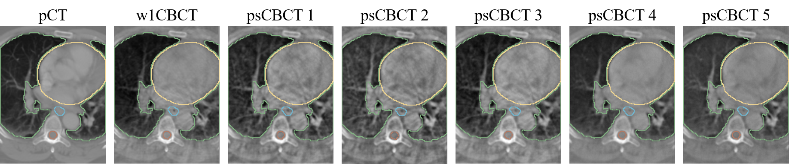

### Physics-ArX: Physics-based data augmentation for CT and CBCT quantification in radiotherapy

Physics-ArX python library provides an easy-to-use physics-based data augmentation pipeline for inducing realistic cone-beam CT (CBCT) artifacts on high-quality planning CT images, which results in perfectly paired/registered 3D synthetic CBCT (sCBCT) and planning CT (+ segmentation/dose) data. The motivation behind Physics-ArX library is to create a computationally cheap and deterministic pipeline to deteriorate high-quality planning CT images to simulate realistic CBCT image variations while leveraging high-quality gross tumor volume (GTV) and organs-at-risk (OARs) segmentations to train robust and generalizable fully-supervised deep learning algorithms (this is in contrast to prior approaches that rely on unpaired CT-CBCT data and error-prone/hallucinating unsupervised deep learning algorithms). Specifically, the scatter artifacts are extracted and transferred from corresponding baseline (pre-treatment) CBCT image whereas the motion artifacts are derived from corresponding 4D CT image (both baseline CBCT and 4D CT images are easily accessible/available in non-small cell lung cancer radiotherapy settings). 

For preliminary data, we have shown that segmentation models trained on our Physics-ArX augmentated data can generalize across CT and CBCT images (**PMB'21**). Moreover, since Physics-ArX results in large number of perfecly-paired/registered planning CT and sCBCT variations, for the first time we also created 3D multitask CBCT-to-CT translation and OAR segmentation deep learning models that can quantify all daily/weekly CBCTs acquired during radiotherapy (**Medical Physics'21**). Finally, we also demonstrated a new motion artifact induction pipeline for CT and CBCT images using 4D CT data in our **AAPM'21 abstract**.     

## Updates:
- [x] Physics-ArX scatter-artifact induction and data augmentation pipeline, given planning CT and baseline CBCT input
- [x] Multitask 3D CBCT-to-CT translation and organs-at-risk segmentation using physics-based (scatter artifact induced) data augmentation (**Medical Physics'21**)
- [ ] Generalizable cross-modal CT and CBCT esophagus segmentation using physics-based (scatter artifact induced) data augmentation (**PMB'21**) 
- [ ] Motion artifact induction on CT and CBCT using 4D CT data (**AAPM'21**)
- [ ] Test on sites other than lung, e.g. head-and-neck and pancreas

### Multitask 3D CBCT-to-CT Translation and Organs-at-Risk Segmentation Using Physics-Based Data Augmentation

[Read Link](https://arxiv.org/abs/2103.05690v2)

*Weekly cone-beam computed tomography (CBCT) images are primarily used for patient setup during radiotherapy. To quantify CBCT images, we present a 3D multitask deep learning model for simultaneous CBCT-to-CT translation and organs-at-risk (OARs) segmentation driven by a novel physics-based artifact/noise-induction data augmentation pipeline. The data augmentation technique creates multiple paired/registered synthetic CBCTs corresponding to a single planning CT which in turn can be used to translate real weekly CBCTs to better quality CTs while performing OAR segmentation using the high-quality planning CT contours. Given the resultant perfectly-paired CBCT and planning CT/contours data, we use supervised conditional generative adversarial network as the base model which, unlike CycleGAN -- prevalent in CBCT-to-CT translation literature -- and other unsupervised image-to-image translation methods, does not hallucinate or produce randomized outputs. We also use a large 95 patient lung cancer dataset with planning CT and weekly CBCTs.*
**Figure**. *Entire workflow of generating different variations of perfectly paired pseudo CBCT variations from single deformable registered planning CT and week1 CBCT pair. The generated data is used to train a multitask 3D pix2pix model to generate synthetic CT and OAR segmentations.*
## Prerequisites:
```del
NVIDIA GPU (Tested on NVIDIA RTX 2080 Ti)
CUDA CuDNN (CPU mode and CUDA without CuDNN may work with minimal modification)
Python 3
Pytorch>=0.4.0
torchvision>=0.2.1
dominate>=2.3.1
visdom>=0.1.8.3
```

## Dataset:
All images must be 128x128x128 in size (DxHxW). During training the network takes a 128x128x128 CBCT image as input and produces the corresponding synthetic CT and a synthetic multi-label OAR segmentation. During training, to compute the loss functions, it also needs the real CT and real multi-label OAR segmentation. So, all images are converted into numpy (*.npz) images which can store multiple arrays as dictionaries. The dictionaries keys are 'CT', 'CBCT' and 'RTSTRUCTS'. Multiple RT structures (OAR segmentations), are converted into single multi-label image. We trained our models with Esophagus label = 4, spinal cord = 3, heart = 2 and lungs = 1. 

For testing purpose, for any unavailable image in the pairing set, just put the CBCT image or a blank image in the final paired image in place of the missing image in the pair. Some example python scripts are provided in 'preprocess' subdirectory as examples of preprocessing needed to produce training/testing data. 
Data needs to be arranged in the following order:
```
datasets/XXX_Dataset 
    ├── test
    ├── val
    └── train
```

## Training:
To train a model:
```
python train.py --dataroot ./datasets/XXX_Dataset
                --netG unet_128 
                --name Experiment_Name
                --stabilize 
                --input_nc 1 
                --output_nc 2 
                --model pix2pix3d 
                --direction BtoA 
                --lambda_L1 100 
                --dataset_mode cbct2ct3d 
                --norm batch --batch_size 1 
                --display_port 8097 
                --lr 0.0001 
                --display_freq 1000 
                --print_freq 1
```
* To view training losses and results, open the URL http://localhost:8097. For cloud servers replace localhost with your IP.
* To epoch-wise intermediate training results, ./checkpoints/Experiment_Name/web/images
* Trained models will be by default save in ./checkpoints/Experiment_Name.
* You can also put the training command above in scripts/train_cbct2ct3d.sh and simply run ./scripts/train_cbct2ct3d.sh from command line.
## Testing:
To test the model:
```
python test.py --dataroot ./datasets/XXX_Dataset
               --netG unet_128 
               --name Experiment_Name 
               --phase test 
               --mode eval 
               --model pix2pix3d 
               --input_nc 1 
               --output_nc 2 
               --direction BtoA 
               --dataset_mode cbct2ct3d
               --norm batch
```
* The test results will be by default saved to ./results/Experiment_Name/test_latest/npz_images.
* Pretrained models can be downloaded [here](https://zenodo.org/record/5002882#.YM_ukXVKiZQ). Place the pretrained model in ./checkpoints/Experiment_Name/.
* To test the model input images can be prepared similar to training stage. Examples are given in 'preprocess' sub-directory.
* To compute statistics for translation and segmentation tasks, some example scripts are given in 'statistics' subdirectory. The functions in these scripts can be used as termplates to compute dice/mae/mse/hausdorff distances etc. similar to the paper.
* Example script is also provided to run connected component analysis on the segmentation results to keep only the largest blob.

## More options?
You can find more options in:
* **./options/base_option.py** for basic options for training and testing purposes. 
* **./options/train_options.py** for advanced training options.
* **./options/test_options.py** for advanced testing options.

## Public Dataset:
The best model in our paper was trained with a combination of our internal Memorial Sloan Kettering Cancer Center (MSKCC) data 
and AAPM Thoracic Auto-segmentation Challenge data (http://aapmchallenges.cloudapp.net/competitions/3). Unfortunately, MSKCC data 
cannot be publicly released due to data privacy concerns. However, AAPM data is available publicly.
We have augmented the AAPM data (which only contained plan CT and OAR segmentations) using our physics-based 
augmentation techniques followed by geometric (rotation/scale/shear/noise) augmentations to generate perfectly paired pCT/psCBCT/OAR pairs which can be used for training/testing. 
This augmented data is available for download [here](https://zenodo.org/record/5035494#.YNjIqnVKi0o). 
The data needs to be converted to numpy (*.npz) format for training/testing using instructions above.

An example dataset is generated using ./preprocess/prep_test_data_pseudo_cbct_3D.py. The npz file is 
saved in ./datasets/psAAPM/test folder and the resulting synthetic CT and OAR segmentation, after running the testing script using the trained model, is saved in 
./results/msk_aapm_stabilized_eso4/test_latest/npz_images

## Physics-based Augmentation Pipeline:
The multitask CBCT to CT translation and OAR segmentation models are based on a physics-based artifact/noise induction data augmentation pipeline.
Broadly, this is a methodology to extract different types of noise artifacts from CBCT images and adding these noise artifacts to planning CT (pCT) images
to generate several synthetic pseudo-CBCT (psCBCT) images from a single registered pair of CT-CBCT images. Following figure shows example of a week 1 CBCT image deformably registered to a corresponding
pCT image. Several types of noise artifacts are extracted from the registered week 1 CBCT, added to the corresponding pCT and followed by reconstruction using OS-SART technique leading to
the generation of several pseudo-CBCT's from a single case.
**Figure**. *Example slices of five different
variations of psCBCT images generated by transferring artifacts/noise from week 1 CBCT to pCT and reconstructing using
OS-SART technique. The five different variations correspond to different parameters in the power-law adaptive histogram
equalization (PL-AHE) technique. The organs-at-risk masks manually segmented on pCT images are perfectly paired to all different
psCBCT variations as well.*
These synthetic CBCT/CT are further augmented with
geometric augmentations leading to creation of large database of perfectly paired pCT/psCBCT images from a small set of registered pCT and week1 CBCT images.
This physics-based augmentation process is described in our separate paper: Generalizable cone beam CT esophagus segmentation using physics-based data augmentation [link](https://pubmed.ncbi.nlm.nih.gov/33535199/) .
There are several steps in this process and we provide code with data samples for all steps.
### Artifact extraction: ###
The first step is to extract artifacts from deformably registered week1 CBCT using Power Law Adaptive Histogram Equilization. Code for this step is
in the following folder:
```
Physics-based-Augmentation/Artifact-Induction 
```
The code was built and tested on Ubuntu 20.04 but the steps should be easily reproducible on other linux based systems. It requires ITK Insight Toolkit [link](https://itk.org/download/) and cmake-gui. Steps:
* Download and install ITK toolkit. In the extracted ITK directory, do: mkdir BUILD; cd BUILD; ccmake ../ ; configure ('c'), generate ('g'); make; make install;
* Navigate to each of the sub-directories in Cpp-codes subfolder; mkdir BUILD; cd BUILD; ccmake ../src; configure ('c'), generate ('g'); make;
* Copy all the executables from last step to where 'CBCT_pCT_Artifact_adding.sh' script is located. Alternatively, change path in the script to point to the executables.
* A sample pCT and deformably registered week 1 CBCT is is provided in 'Patients' sub-directory.
* ./CBCT_pCT_Artifact_adding.sh
* The above step will produce the artifact added CT's which can then be reconstructed using the OS-SART algorithm described next.

### OS-SART based CT image reconstruction: ###
Artifact induced Pseudo-CBCT images are reconstructed using the open source TIGRE libraries. The codes/installation was tested in Anaconda virtual environment. Sample python script to reconstruct pseudo CBCT images is provided in subdirectory:
```
Physics-based-Augmentation/OSSART-Reconstruction 
```
Prerequisites:
```del
NVIDIA GPU (Tested on NVIDIA RTX 2080 Ti)
CUDA CuDNN: cudatoolkit-dev
Python 3.7
numpy
cython
simpleitk (conda install -c simpleitk SimpleITK)
```
* Download and install TIGRE platform [link](https://github.com/CERN/TIGRE) .
* To install tigre: git clone https://github.com/CERN/TIGRE
* Create and activate a new anaconda environment. conda install the above prerequisities.
* cd TIGRE/Python
* python setup.py install --user
* To run the code: conda activate created_environment; python pCT_CBCT_Reconstruction.py
* Optionally change the path to the artifact added images in the pCT_CBCT_Reconstruction.py script.

### Geometric Augmentation: ###
The psCBCT images are further enhanced with geometric augmentations using imgaug library. Install the following prerequisities in an anaconda environment.
```del
Python 3.7
conda install -c conda-forge imgaug
conda install -c conda-forge pynrrd
conda install scikit-image
```
* Run the python script augmentation.py in Physics-based-Augmentation/Geometric-Augmentations subdirectory. A sample dataset from AAPM dataset is provided.

## Issues
Please report all issues on the public forum.

## License
© [Nadeem Lab](https://nadeemlab.org/) - This code is distributed under **Apache 2.0 with Commons Clause** license, and is available for non-commercial academic purposes. 

## Acknowledgments
* This code is inspired by [CycleGAN and pix2pix in PyTorch](https://github.com/junyanz/pytorch-CycleGAN-and-pix2pix).

## Reference
If you find our work useful in your research or if you use parts of this code please consider citing our paper:
```
@article{Dahiya2021Multitask3C,
  title={Multitask 3D CBCT-to-CT Translation and Organs-at-Risk Segmentation Using Physics-Based Data Augmentation},
  author={N. Dahiya and S. Alam and Pengpeng Zhang and Si-Yuan Zhang and A. Yezzi and S. Nadeem},
  journal={Medical Physics},
  year={2021},
}

@article{alam2021generalizable,
  title={Generalizable cone beam CT esophagus segmentation using physics-based data augmentation},
  author={Alam, Sadegh R and Li, Tianfang and Zhang, Pengpeng and Zhang, Si-Yuan and Nadeem, Saad},
  journal={Physics in Medicine \& Biology},
  volume={66},
  number={6},
  pages={065008},
  year={2021},
  publisher={IOP Publishing}
}

@article{alam2021motion,
  title={Physics-based motion artifact simulation in CT/CBCT images using 4DCT phases},
  author={Alam, Sadegh R and Li, Tianfang and Zhang, Si-Yuan and Zhang, Pengpeng and Nadeem, Saad},
  journal={AAPM'21 abstract},
  year={2021}
}
```
